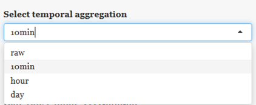
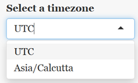
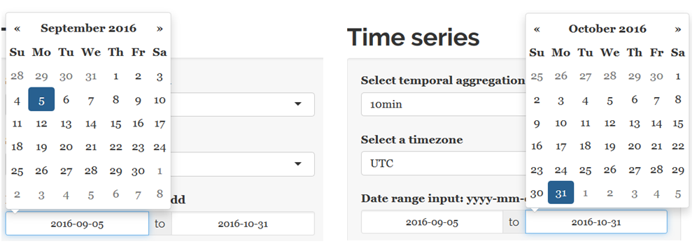
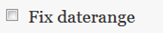
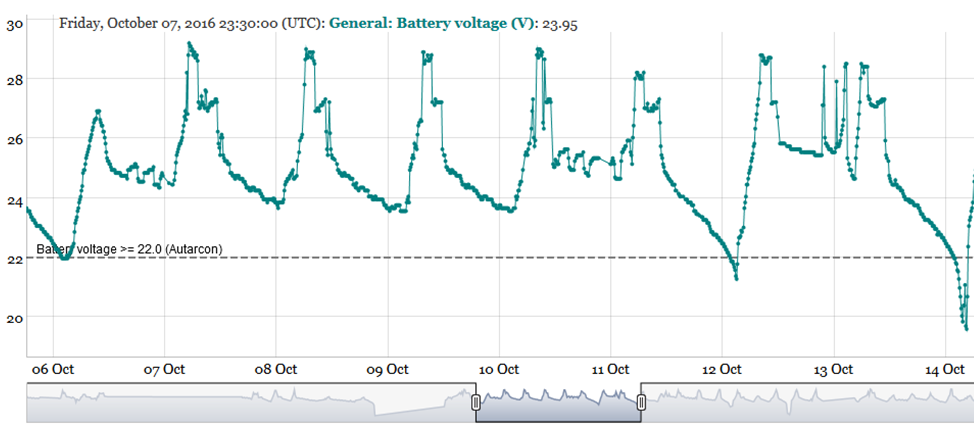
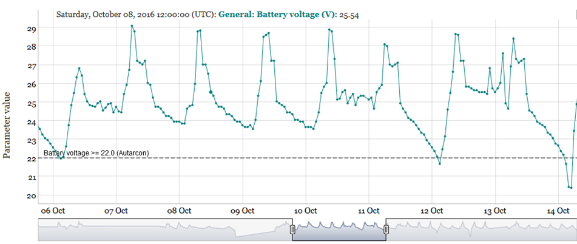
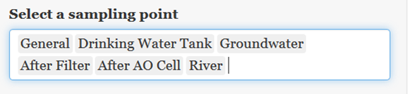
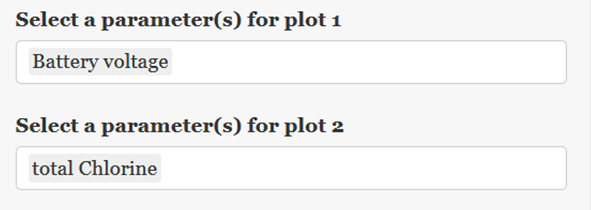
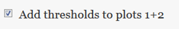

The explore panel (see Figure 1) enables the user to: 

-	Inspect online and offline data using different temporal aggregation levels 
(i.e. raw data or median values for 10 minutes, 1 hour or 1 day) 

-	Export data

With the panel on the left hand sight the user can change the initial settings 
(e.g. temporal data ag-gregation level, select different sampling points, 
parameters or date ranges).

The two plots on the right hand sight are coupled (i.e. both share the same 
x-axis limits), which ena-bles an easy comparison in case two different 
parameters are selected for top and bottom plot.

All available features are described in detail in the following sub-chapters.

```{r fig1, echo = FALSE}
knitr::include_graphics("figures/1.png")
```

The “select temporal aggregation” input menu offers four different options as 
shown below: 

```{r fig2, echo = FALSE}

```
Figure 2  Select temporal aggregation (default setting)

Only in case of “raw” no temporal aggregation is performed and just the raw 
data will be returned. However, this can be quite time consuming in case of 
large data amounts (e.g. for online data rec-orded at short time intervals).  
All other options perform a temporal aggregation of the underlying data by 
calculating the median values for all parameters for 10 minutes (selection: 
“10min”), hourly (selection: “hour”) or daily (se-lection: “day”) time periods. 
By default, the R reporting tool aggregates the parameter values as 10 minutes 
median values.  

## 3.1.2	Select a time zone
By default, all data are presented in UTC. However, it is also possible to 
transform the time zone to the site’s local time (i.e. Asia/Calcutta) as shown 
below in Figure 3.

```{r fig3, echo = FALSE}

```
Figure 3  Select a time zone (default setting)

## 3.1.3	Select date range
By default the date range starts on 2016-09-05 and ends on 2016-10-31 as shown 
below in Figure 4.

```{r fig4, echo = FALSE}
knitr::include_graphics("figures/4.png")
```
Figure 4  Select a date range (default setting)

However, the date range can be changed easily by clicking with the mouse into 
the start/end field, which opens a calender for specifying new start/end dates 
as shown below in Figure 5. The selected date range is the range displayed at 
the largest zoom level. In the interactive graph the zoom function can be used 
to zoom to specific date/time ranges within the specified date range.

 
```{r fig5, echo = FALSE}

```
Figure 5  Select a date range (change the default setting)

## 3.1.4	Fix date range 
The checkbox option Fix daterange (Figure 6) is relevant in case of interactive 
zooms into plots. 

```{r fig6, echo = FALSE}

```
Figure 6  Fix daterange (default setting)

In case the Fix daterange option is disabled (default setting, see Figure 6 above) 
and the zoom is set to a specific period (e.g. ~ 2016-10-10 – ~ 2016-10-11 as 
shown in Figure 7), the zoom level will be lost (Figure 8) if the parameterisation 
is changed (e.g. switching from “10min” to “hour” values). 

```{r fig7, echo = FALSE}

```
Figure 7  Interactive zoom to user defined period (~2016-10-10 to ~2016-10-11) 
with 10min aggregation
 
```{r fig8, echo = FALSE}
knitr::include_graphics("figures/8.png")
```

Figure 8 Plot with disabled “Fix daterange” after change of temporal aggregation 
(“hour”) 

For avoiding this behaviour it is necessary to enable the Fix daterange checkbox 
and the selected zoom level will remain even when the parameterisation is changed 
afterwards as shown in Figure 9.

```{r fig9, echo = FALSE}

```

Figure 9 Plot with enabled “Fix daterange”: changed temporal aggregation (“hour”) 

## 3.1.5	Select sampling point(s)
By default all available sampling points are selected, as shown below in Figure 10.

```{r fig10, echo = FALSE}

```

Figure 10  Select a sampling point (default setting)

For removal of selected sampling points they need to be marked (by holding Ctrl 
and clicking on them with the mouse, see Figure 11, left) and subsequently 
deleted by pressing the Delete button on your keyboard. The deleted sampling 
points are still available in a drop down menu (see Figure 11, right), where 
they can be easily added again (i.e. by selecting them with the mouse).

```{r fig11, echo = FALSE}
knitr::include_graphics("figures/11.png")
```   

Figure 11  Select a sampling point (change default setting)

## 3.1.6	Select parameter(s) for plot 1/2

By default, one parameter for each plot is pre-selected (i.e. battery voltage 
for plot1 and total chlorine for plot2), as shown below in Figure 12.

```{r fig12, echo = FALSE}

```

Figure 12  Select parameter(s) for plot 1/2 (default setting)

One the one hand it is possible to select a different parameter for each plot 
(based on the available online/offline parameters for the Haridwar site in the 
dropdown list) as shown in Figure 13 below: 

```{r fig13, echo = FALSE}
knitr::include_graphics("figures/13.png")
```    

Figure 13  Select parameter(s) for plot 1 and 2 (change default setting)

On the other hand it is also possible to select multiple parameters for one plot. 
However, plotting multiple parameters with completely different data value ranges 
(e.g. parameter1: 0 – 1, parameter2: 100-10000) should be avoided as the graph 
does not support multiple y axis.

## 3.1.7	Add thresholds to plot 1+2

By default, threshold parameters are added to both plots for parameters, for 
which thresholds were predefined (see Figure 14, example graph with thresholds 
e.g. Figure 9). This feature can be disabled by unchecking the checkbox. In the 
latter case no horizontal lines will be plotted if a selected param-eter has a 
pre-defined threshold.

```{r fig14, echo = FALSE}

```

Figure 14  Add thresholds to plots 1+2 (default setting)

**Note:**
***The thresholds can be modified by the user, which is described [here](A4_modify.html).***

## 3.1.8	Download options

There are two different download options available: 

-	Download data: download the entire dataset of plot 1 or 2 as CSV with the 
selected tem-poral aggregation level (Chapter 3.1.1), time zone (Chapter 3.1.2) 
and date range (Chapter 3.1.3) at all selected sampling points (Chapter 3.1.5) 
for the parameters in plot 1 or 2 (Chapter 3.1.6), respectively. 

-	Download plot: downloads plot 1 and 2 as HTML document (including all data 
points of selected temporal aggregation). This document still provides interactive 
zooming capabilities for the selected dataset and can be send as stand-alone HTML 
document via email.
