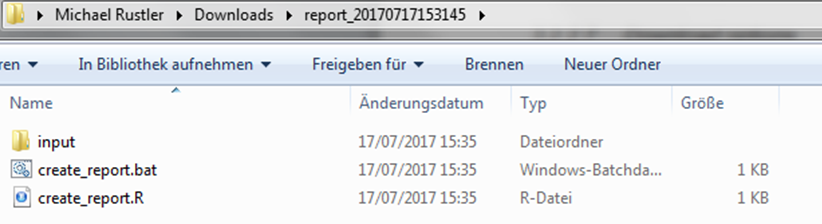
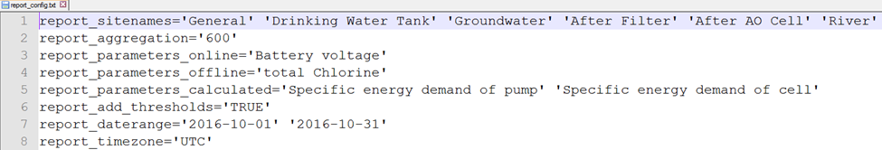
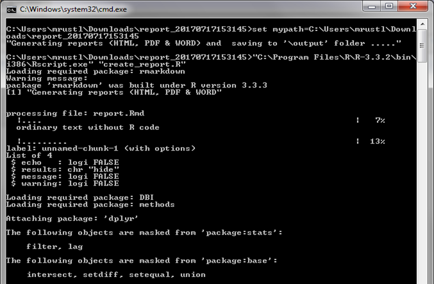

Within the report panel  automated reports with user defined parameterisation 
can be generated and will be previewed in HTML below the Update report preview 
button (top right in Figure below) once it is clicked. 
 
```{r report_tab_panel, echo = FALSE} 
knitr::include_graphics("figures/15.png")
```
Figure 15 Screenshot of the “Report” tab panel

Using the default parameterisation (see Figure above) and clicking the "Update 
report preview"" button the HTML preview for the Haridwar site can be explored 
by clicking the link below:
```{r automated_report_haridwar, echo = FALSE}
knitr::include_graphics("figures/automated_report_haridwar.html")
```

In the following sub-chapters the available options for parameterising 
(Chapters 3.2.1 - 3.2.6) and downloading (Chapter 3.2.7) the report are described 
in detail. 


## 3.2.1	Select temporal aggregation
see Chapter 3.1.1

## 3.2.2	Select a time zone
see Chapter 3.1.2

## 3.2.3	Select a reporting period
For selection the reporting period two  options (“monthly” and “user-defined”) 
are available as shown in the Figure below. 

```{r select_reporting_period, echo = FALSE}

```
Figure 18 Select “monthly” reporting period

**Monthly** 
If the option monthly is selected in the Select reporting period step, the user 
can choose from a drop-down box one of the available months (i.e. September 2016 
– July 2017), for which data is available for the Haridwar site as shown in the 
Figure below.
 
```{r select_monthly_reporting_period, echo = FALSE}
knitr::include_graphics("figures/19.png")
```

**User defined**
This option enables the user to select a specific time period (e.g. 2016-09-05 
to 2016-10-31) by defining the date range as already described in [Chapter 3.2.3](##3-2-3-select-a-reporting-period).

## 3.2.4	Select sampling points 

see Chapter 3.1.5

## 3.2.5	Select parameters 

The user can select the following parameters: 

-	Online

-	Offline 

-	Calculated 

**Note:**
***The parameter selection workflow is the same as described in Chapter 3.1.6.***

## 3.2.6	Add thresholds to offline/online parameters

see Chapter 3.1.7

## 3.2.7	Download options

There are two different download options available as shown in Figure 20: 

-	Basic: Generate & download report: clicking this option generates and downloads 
the report using the user defined parameterisation in your selected report format 
(html, docx or pdf) and saves it with the name “automated_report.YOUR_SELECTED_FORMAT”

-	Advanced: Download standalone report (zip): clicking this option downloads a 
.ZIP file with the name “report_DateTime.zip” (with DateTime = date time of 
download). Using this approach only exports the user defined report configuration 
without already generating the report output. This option may be useful if a user 
defined configuration should be saved and automatically all three report formats 
(i.e. pdf, docx and html) should be generated. 
 
```{r report_download_options, echo = FALSE}

```
Figure 19 Report download options

**Workflow for “Download standalone report (zip)”**

Due to the higher complexity for using the standalone report option the required 
workflow.

***Step 1: Download*** 
Download a “report_DatTime.zip” (with DateTime = date time of download)  by 
clicking on “Down-load standalone report (zip)”

***Step 2a: Unzip**

After downloading unzip all files to a folder of your choice, e.g.: 
C:/Users/YOUR_USERNAME/Downloads/report_20170717153145/

The files in this folder must be identical to Figure 21 and the files in the 
subfolder “input” should must to be identical with the ones shown in Figure 22.
 
```{r file1, echo = FALSE}

```

Figure 21 Folder “…/report_20170717153145” with unzipped files of “report_20170717153145.zip”

```{r file2, echo = FALSE}

```
Figure 22 Files in subfolder “input” of “report_20170717153145”

***Step 2b (optional): Change reporting period*** 
Inspecting “report_config.txt” in an editor shows which user defined 
parameterisation was exported (Figure 23). Modifying this configuration file 
manually is not recommended as it may introduce errors. 
However, an exception is the parameter report_daterange (line 7) as it is 
self-explaining enough for being adapted by the user and enables to generate 
the report for a different time period (com-pared to the one initially defined 
at the time of the download). 
For doing you the starting and end of the time period need to be specified in 
the following format: 
report_daterange='YYYY-MM-DD' 'YYYY-MM-DD' 
For this tutorial the reporting period was changed to 2016-11-01 until 2016-11-30 
(see Figure 24). 

```{r fig23, echo = FALSE}
knitr::include_graphics("figures/23.png")
```

Figure 23 “report_config.txt” with user defined report configuration (downloaded configuration) 

```{r fig24, echo = FALSE}

```
Figure 24 “report_config.txt” after modifying parameter “report_daterange” (line 7) 

***Step 3: Generate the report***
For generating the reports you need to execute the file “create_report.bat” 
(which is located in the main directory of the unzipped report folder, see 
Figure 21) by double-clicking. Subsequently you will see a security warning, 
which you need to accept (Figure 25).


```{r fig25, echo = FALSE}

```
Figure 25 Accept security warning to exeute “create_report.bat”

In a next step the MS DOS command line will open with a similar output as shown in Figure 26. 


```{r fig26, echo = FALSE}
knitr::include_graphics("figures/26.png")
```
Figure 26 MS DOS output after starting execution of “create_report.bat”


This step may take a while as the report is generated by default in all three 
different formats (pdf, html, docx) and depending und the length of the 
reporting period (and the amount of raw data) this requires some time.
Finally the report generation should end similar to this output (Figure 27):

```{r fig27, echo = FALSE}
knitr::include_graphics("figures/27.png")
```
Figure 27 MS DOS output after completing execution of “create_report.bat”


Now you can inspect the reports in PDF, HTML and DOCX format in the newly 
created subfolder “/output” (Figure 28).

```{r fig28, echo = FALSE}
knitr::include_graphics("figures/28.png")
```
Figure 28 Report files in subfolder “output” of “report_20170717153145”
